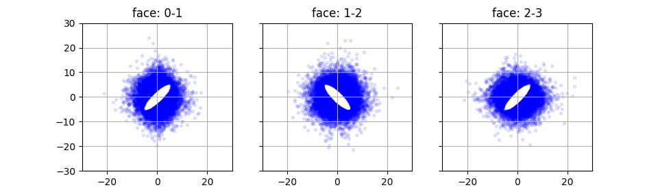
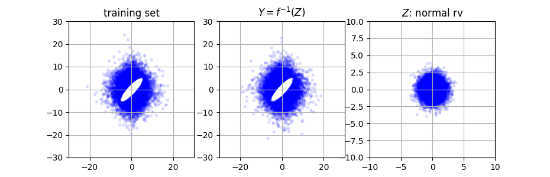

# KRnet

We provide an deep invertible mapping that can be used for generative modeling and density estimation. The algorithm is defined in *[K. Tang, X. Wan and Q. Liao, Deep density estimation via invertible block-triangular mapping, Theoretical & Applied Mechanics Letters, 10 (2020), 000-5]*, which can be found  [here](https://www.math.lsu.edu/~xlwan/publication.html). KRnet provides a generalization of the [real NVP](https://arxiv.org/abs/1605.08803) for density estimation.  

## Code description

The code is based on TensorFlow 2. The main function is defined in *train.py*. Other files, including *BR_data.py*, *BR_layers.py* and *BR_model.py,* are located in the directory BR_lib. The *train.py* is ready to run, which can be used to for the numerical example in the aforementioned paper. The model KRnet is defined in *BR_model.py*; All bijection layers are defined in *BR_layers.py*; The dataflow and some related utilities are included in *BR_data.py*.

## Example

We consider a training set of dimension 4 as illustrated in the following figure. 

The definition of the dataset can be found in the aforementioned paper. Roughly speaking, we consider 4d Logistic distribution, where we generate an elliptic hole for two adjacent dimensions. What the KRnet does is shown in the following figure, where we compare the training set and the samples generated by KRnet:

Simply speaking, the KRnet will map a 4d standard Gaussian to the empirical distribution given by the 4d dataset. We here only plot the first two dimensions. Here $Z$ indicates a standard Gaussian random variable, $Y$ the random variable corresponding to the dataset, and $z=f(y)$ and invertible mapping given by KRnet. 